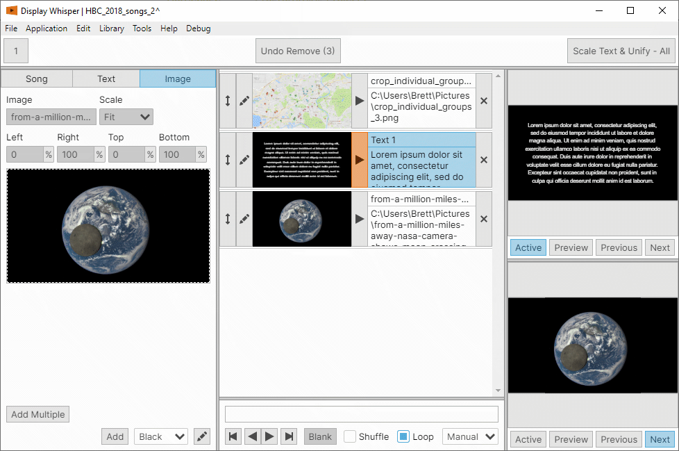
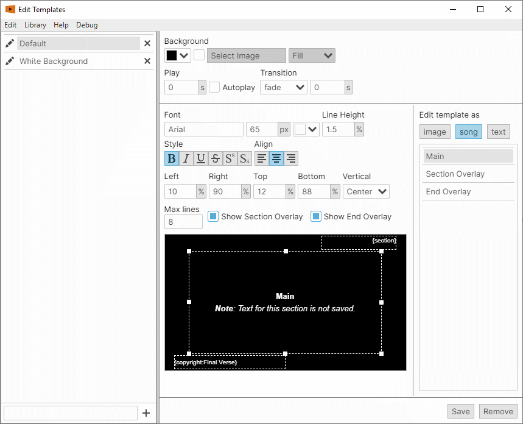

Simple to use solution for song lyrics, text, and image presentaions.
Using Node.js and Electron.

<!--more-->

Users can add songs, text items or images to the presentation. The resulting slides can then be displayed on any computer display output.
Songs can be saved to a library, which can then searched for and easily added to any other presentation.

There is a template system, to setup preset "styles" for textual or image content. Templates can then be quickly applied to different items in a presentation, giving a uniform appearance to all items.

