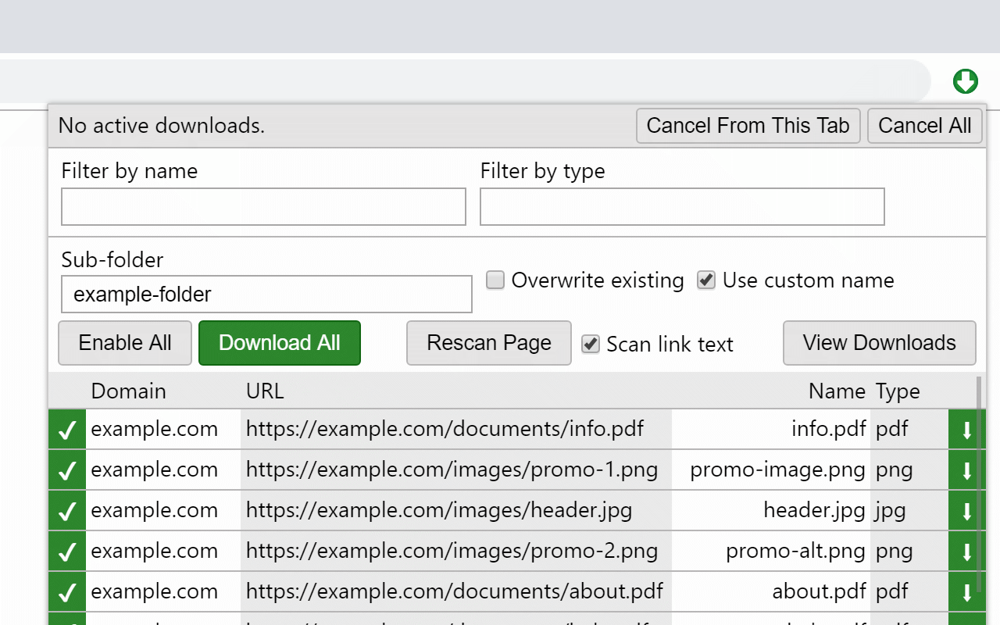

A Chrome extension to quickly download all files linked in a page.

<!--more-->

When activated on a page, it scans the page for links and other HTML tags containing file URLs. The user can then filter the files which have been found, and automatically download all chosen files.

